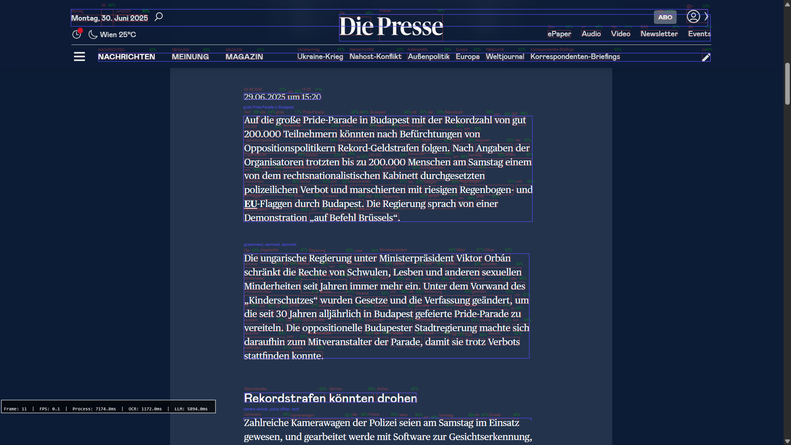

# EasyRead

EasyRead is a tool made with Python which automatically detects text on screens and highlights relevant keywords to enhance the casual reading experience. It is made for the [BWKI Österreich](https://bwki.asai.ac.at/) competition.

*In-Development image of a prototype showing word & paragraph detection as well as primitive keyword extraction*

## Workflow

1. A screenshot is taken using **mss**.
2. Text is detected on the screen using **Pytesseract**, which is a Python interface for **Tesseract OCR**, as well as finding text groups like paragraphs.
3. Contextually relevant keywords of the text are found through the usage of an LLM with **transformers**.
4. The keywords are underlined on the screen through an overlay using **PyQt**.

## AI Usage

- Text detection and recognition with **Tesseract**.
- Keyword extraction with **transformers**-based LLMs.

## Languages

- Python 3.13

## Setup

- Download/Clone repository
- Install Python 3.13
- Create Python Virtual Environment
`bash
python -m venv py313_env
`
- Activate Python environment
`bash
./py313_env/Scripts/activate
`
- Download Python libraries
`bash
pip install requirements
`
- Install Tesseract
(Windows) `bash
choco install tesseract
`
(Linux) `bash
sudo apt update
sudo apt install tesseract-ocr libtesseract-dev
`
(macOS) `bash
brew install tesseract
`
- Verify Tesseract installation
`bash
python test_ocr.py
`
Should output: "Recognized text: OCR Test Successful!"
- Create AI Model Directory
`bash
mkdir models
`
- Download AI Models
`bash
python -c "
from transformers import pipeline
pipe = pipeline('text2text-generation', model='google/flan-t5-small')
pipe.save_pretrained('./models/flan-t5-small')
"
`
"/models" should now contain a directory called "flan-t5-small"
- Run Application
`bash
python main.py
`
